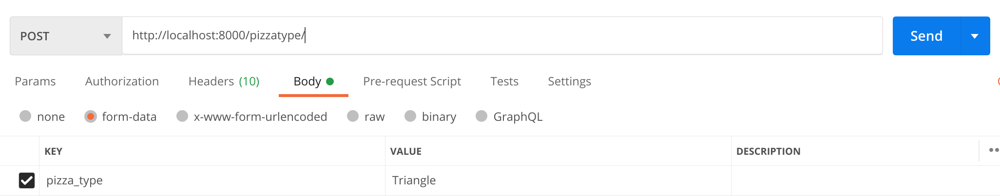
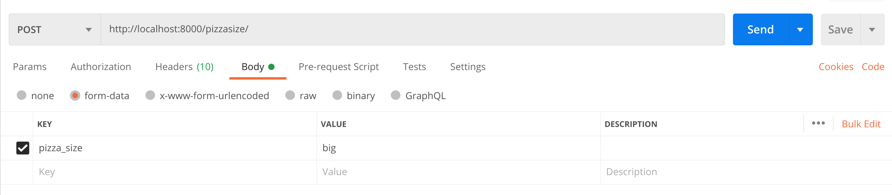

# PizzaMaker-Restapi
## Restapi For Pizza Management:
### This Application Uses Django-rest-Framework For Pizza Management.
<br>

*By Using this appication Admin can Add Pizzatypes to Database*<br>
*By Using this appication Admin can Add Pizzasizes to Database*<br>
*By Using this appication Admin can Add Pizzatoppings to Database*<br>
*By Usinng this application Admin filter Order based on Pizzatype and Pizzasize*<br>
<br>
*Based On Data about Pizzatypes,Pizzasizes,Pizzatoppings in Database 
Input provided by EndUser is Validated if If input Field not Present in Database
Api will Raise validation errors*

## DataBase Schema

| Tables        | ColumnsName   |        
| ------------- |:-------------:|          
| pizza_type   | `pizza_type` (varchar) |
| pizza_size      | `pizza_size` (varchar)      | 
| pizza_toppings  |  `pizza_toppings` (varchar)             |
| user_pizza      |   `pizza_type` (Forignkey), `pizza_size`(Forignkey), `Pizzajson`(json)|
  <br>

### Api Endpoints Details
<code>
    path('pizzatype/',Pizzatypeview.as_view())<br>
    path('pizzasize/',Pizzasizeview.as_view())
    path('pizzatopping/',Pizzatoppingview.as_view())
    path('makepizza/',makepizza.as_view())
    path('deletetopping/<str:topping>', PizzaToppingDeleteView.as_view())
    path('deletesize/<str:size>', PizzaSizeDeleteView.as_view())
    path('deletetype/<str:type>', PizzaTypeDeleteView.as_view())
    path('makepizza/<int:id>', getpizzabyid.as_view())
    path('filtertype/<str:type>', filterpizza.as_view({'get': 'get_selected_pizza_type'}))
    path('filtersize/<str:size>', filterpizza.as_view({'get': 'get_selected_pizza_size'}))
</code>

###EndPoint Details
### On Url: `localhost:8000/`
##1
```
pizzatype/
```
Can take Request  `GET` ,`POST`<br>
On GET Request: Expected Response if data Is Present in DataBase
```
{
    "data": [
        {
            "pizza_type": "Regular"
        },
        {
            "pizza_type": "Square"
        },
        {
            "pizza_type": "Hexagonal"
        }
    ],
    "status": 302
}
```
On Post Request: with key `pizza_type`
<br>

Expected Response:

```
{
    "status": 201
}
```

if pizza_type already present in Database

```
{
    "pizza_type": [
        "pizza_type with this pizza type already exists."
    ]
}
```


###1.1 Deletion of Pizzatype from table `pizza_type` 
```
deletetype/<str:type>

```
example:

```
deletetype/Regular
```

Can take Request  `DELETE` <br>
On Delete Request: `Regular` is taken as url parameter calls a function to delete object(value from Database)  Expected Response if data Is Present in data Base
```
{
    "status": 202
}
```


##2
```
pizzasize/
```
Can take Request  `GET` ,`POST`<br>
On GET Request: Expected Response if data Is Present in DataBase
```
{
    "data": [
        {
            "pizza_size": "small"
        },
        {
            "pizza_size": "medium"
        },
        {
            "pizza_size": "large"
        },
        {
            "pizza_size": "larger"
        }
    ],
    "status": 200
}
```
On Post Request: with key `pizza_size`
<br>

Expected Response:

```
{
    "status": 201
}
```
if pizza_size already present in Database<br>
Response will be:

```
{
    "pizza_size": [
        "pizza_size with this pizza size already exists."
    ]
}
```
###2.1 Deletion of Pizzatype from table `pizza_type` 
```
deletesize/<str:type>

```
example:

```
deletetype/larger
```

Can take Request  `DELETE` <br>
On Delete Request: `larger` is taken as url parameter calls a function to delete object(value from Database)  Expected Response if data Is Present in data Base
```
{
    "status": 202
}
```


                     
 


