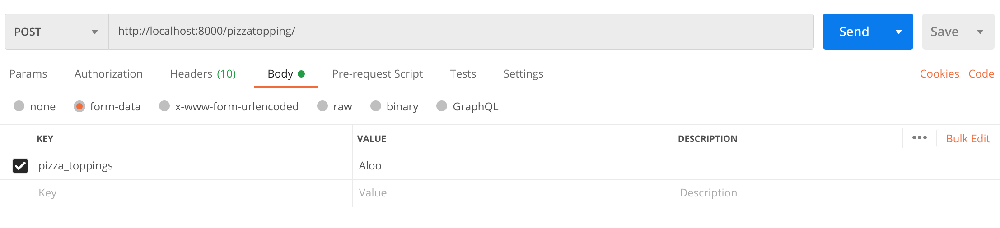
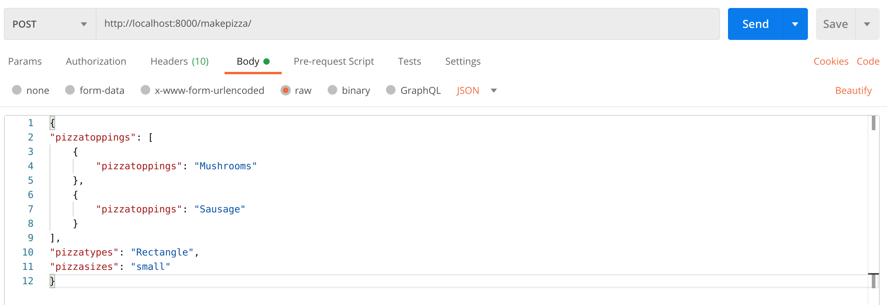
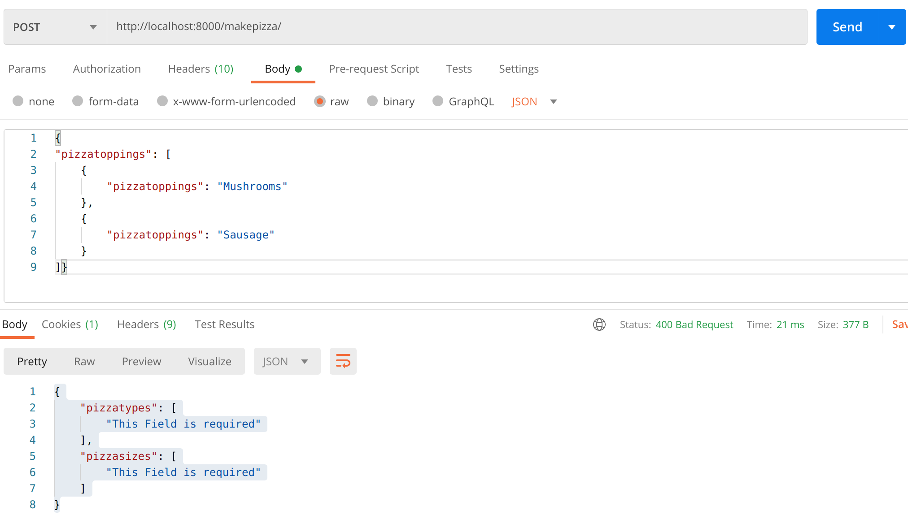

# PizzaMaker-Restapi
## Restapi For Pizza Management:
### This Application Uses Django-rest-Framework For Pizza Management.
<br>

*By Using this appication Admin can Add Pizzatypes to Database*<br>
*By Using this appication Admin can Add Pizzasizes to Database*<br>
*By Using this appication Admin can Add Pizzatoppings to Database*<br>
*By Usinng this application Admin filter Order based on Pizzatype and Pizzasize*<br>
<br>
*Based On Data about Pizzatypes,Pizzasizes,Pizzatoppings in Database 
Input provided by EndUser is Validated if If input Field not Present in Database
Api will Raise validation errors*

## DataBase Schema

| Tables        | ColumnsName   |        
| ------------- |:-------------:|          
| pizza_type   | `pizza_type` (varchar) |
| pizza_size      | `pizza_size` (varchar)      | 
| pizza_toppings  |  `pizza_toppings` (varchar)             |
| user_pizza      |   `pizza_type` (Forignkey), `pizza_size`(Forignkey), `Pizzajson`(json)|
  <br>

### Api Endpoints Details
<code>
    path('pizzatype/',Pizzatypeview.as_view())<br>
    path('pizzasize/',Pizzasizeview.as_view())
    path('pizzatopping/',Pizzatoppingview.as_view())
    path('makepizza/',makepizza.as_view())
    path('deletetopping/<str:topping>', PizzaToppingDeleteView.as_view())
    path('deletesize/<str:size>', PizzaSizeDeleteView.as_view())
    path('deletetype/<str:type>', PizzaTypeDeleteView.as_view())
    path('makepizza/<int:id>', getpizzabyid.as_view())
    path('filtertype/<str:type>', filterpizza.as_view({'get': 'get_selected_pizza_type'}))
    path('filtersize/<str:size>', filterpizza.as_view({'get': 'get_selected_pizza_size'}))
</code>

###EndPoint Details
### On Url: `localhost:8000/`

## 1
=======
### 1

```
pizzatype/
```
Can take Request  `GET` ,`POST`<br>
On GET Request: Expected Response if data Is Present in DataBase
```
{
    "data": [
        {
            "pizza_type": "Regular"
        },
        {
            "pizza_type": "Square"
        },
        {
            "pizza_type": "Hexagonal"
        }
    ],
    "status": 302
}
```
On Post Request: with key `pizza_type`
<br>

Expected Response:

```
{
    "status": 201
}
```

if pizza_type already present in Database

```
{
    "pizza_type": [
        "pizza_type with this pizza type already exists."
    ]
}
```


### 1.1 Deletion of Pizzatype from table `pizza_type` 
```
deletetype/<str:type>

```
example:

```
deletetype/Regular
```

Can take Request  `DELETE` <br>
On Delete Request: `Regular` is taken as url parameter calls a function to delete object(value from Database)  Expected Response if data Is Present in data Base
```
{
    "status": 202
}
```

if the type you are trying to delete does not exist
```
{
    "data": "Data For Given pizza type do not exist"
}
```

## 2
```
pizzasize/
```
Can take Request  `GET` ,`POST`<br>
On GET Request: Expected Response if data Is Present in DataBase
```
{
    "data": [
        {
            "pizza_size": "small"
        },
        {
            "pizza_size": "medium"
        },
        {
            "pizza_size": "large"
        },
        {
            "pizza_size": "larger"
        }
    ],
    "status": 200
}
```
On Post Request: with key `pizza_size`
<br>

Expected Response:

```
{
    "status": 201
}
```
if pizza_size already present in Database<br>
Response will be:

```
{
    "pizza_size": [
        "pizza_size with this pizza size already exists."
    ]
}
```
### 2.1 Deletion of Pizza size object from table `pizza_size` 
```
deletesize/<str:type>

```
example:

```
deletesize/larger
```

Can take Request  `DELETE` <br>
On Delete Request: `larger` is taken as url parameter calls a function to delete object(value from Database)  Expected Response if data Is Present in data Base
```
{
    "status": 202
}
```


if the size you are trying to delete does not exist
```
{
    "data": "Data For Given pizza size do not exist"
}
```


                     
 


## 3
```
pizzatopping/
```
Can take Request  `GET` ,`POST`<br>
On GET Request: Expected Response if data Is Present in DataBase
```
{
    "data": [
        {
            "pizza_toppings": "Broccoli"
        },
        {
            "pizza_toppings": "Mushrooms"
        },
        {
            "pizza_toppings": "Sausage"
        },
        {
            "pizza_toppings": "Bacon"
        },
        {
            "pizza_toppings": "Extra cheese"
        },
        {
            "pizza_toppings": "Green peppers"
        },
        {
            "pizza_toppings": "Pineapple"
        },
        {
            "pizza_toppings": "Spinach"
        },
        {
            "pizza_toppings": "Onion"
        }
    ],
    "status": 200
}
```
On Post Request: with key `pizza_toppings`
<br>

Expected Response:

```
{
    "status": 201
}
```
if pizza_toppings already present in Database<br>
Response will be:

```
{
    "pizza_toppings": [
        "pizza_toppings with this pizza toppings  already exists."
    ]
}
```
### 3.1 Deletion of Pizza toppings object from table `pizza_toppings` 
```
deletetopping/<str:type>

```
example:

```
deletetopping/Pineapple
```

Can take Request  `DELETE` <br>
On Delete Request: `Pineapple` is taken as url parameter calls a function to delete object(value from Database)  Expected Response if data Is Present in data Base
```
{
    "status": 202
}
```

if the topping you are trying to delete does not exist
```
{
    "data": "Data For Given pizza toppings do not exist"
}
```


## 4
```
makepizza/
```
Can take Request  `GET` ,`POST`<br>
On GET Request: Expected Response if data Is Present in DataBase
```
{
    "data": [
        {
            "id": 3,
            "pizzatoppings": [
                {
                    "pizzatoppings": "Mushrooms"
                },
                {
                    "pizzatoppings": "Sausage"
                }
            ],
            "pizzatypes": "Square",
            "pizzasizes": "small"
        },
        {
            "id": 4,
            "pizzatoppings": [
                {
                    "pizzatoppings": "Onion"
                },
                {
                    "pizzatoppings": "Extra cheese"
                }
            ],
            "pizzatypes": "Square",
            "pizzasizes": "large"
        }
    ],
    "status": 200
}
```
On Post Request: with json values like
```
{
"pizzatoppings": [
    {
        "pizzatoppings": "Mushrooms"
    },
    {
        "pizzatoppings": "Sausage"
    },{
        "pizzatoppings": "Olives"
    }
],
"pizzatypes": "Rectangle",
"pizzasizes": "small"
}
```

<br>
Response code you will get:
```
{
    "status": 201
}
```


if you provide invalid json field like blank json 
You will get response as:
```
{
    "pizzatoppings": [
        "This field is required."
    ],
    "pizzatypes": [
        "This Field is required"
    ],
    "pizzasizes": [
        "This Field is required"
    ]
}
with error code 400
```

if any of the field is missing you will get response as
```
{
    "pizzatypes": [
        "This Field is required"
    ],
    "pizzasizes": [
        "This Field is required"
    ]
}
```

for example:
for in post request field pizzatypes,pizzasizes were missing
<br>


If you will put any invalid field in your `Json` post schema you will get 400 error messages<br>
1. if you put invalid input for pizza toppings (means input data which is not in pizza_toppings table):
you will get Validation msgs like
```
{
    "non_field_errors": [
        "choose from Toppings options.options are['Broccoli', 'Mushrooms', 'Sausage', 'Bacon', 'Extra cheese', 'Green peppers', 'Spinach', 'Onion', 'Aloo']"
    ]
}
```
2.if you put invalid input for  pizza_type (means input data which is not in pizza_toppings table):
```
{
    "pizzatypes": [
        "Invalid pk \"Pentagon\" - object does not exist."
    ]
}
```


3.if you put invalid input for  pizza_size (means input data which is not in pizza_toppings table):
```
{
    "pizzasizes": [
        "Invalid pk \"smallest\" - object does not exist."
    ]
}
```

4.if you put multiple invalid inputs you will get multiple Validatation messages  example
```
{
    "pizzatypes": [
        "Invalid pk \"Pentagon\" - object does not exist."
    ],
    "pizzasizes": [
        "Invalid pk \"smallest\" - object does not exist."
    ]
}
```

